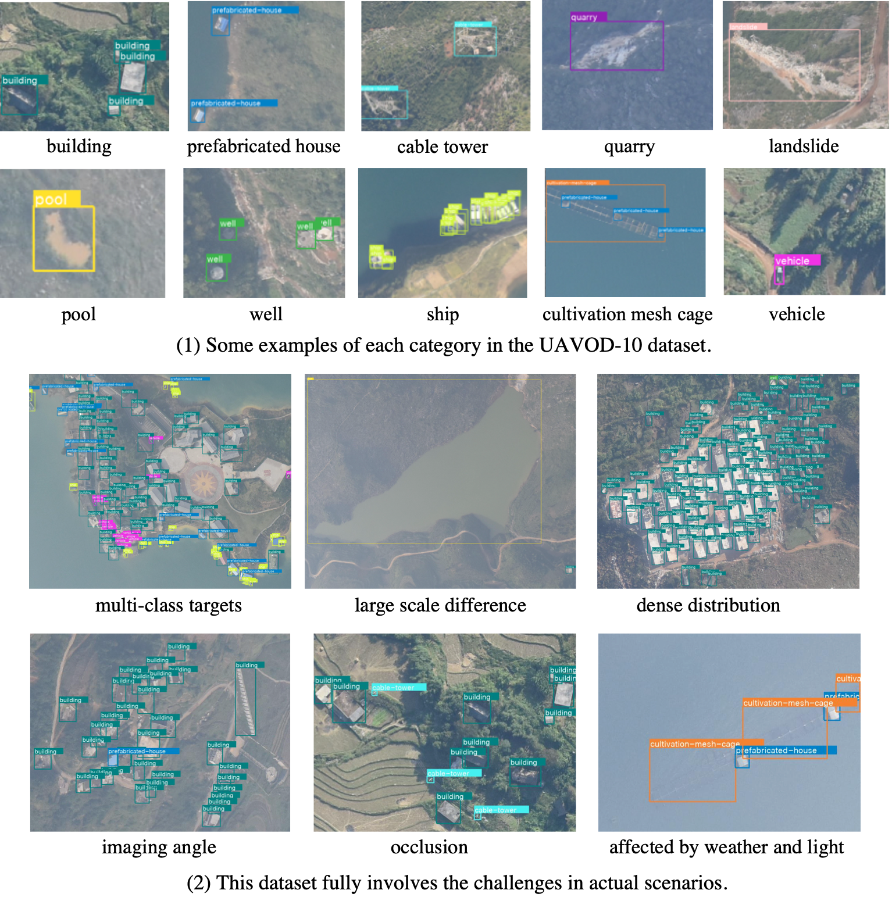

# 10-category-UAV-small-weak-object-detection-dataset-UAVOD-10-
This repository is about downloading and using the UAVOD-10 dataset, which will be available on [Baidu Netdisk](https://pan.baidu.com/s/1GlEiHENSAcG2V8bthTUn6A) or [Google Driver](https://pan.baidu.com/s/1GlEiHENSAcG2V8bthTUn6A) after the relevant paper is published.

The UAVOD-10 consists of 844 images and 18,234 instances. These instances are labeled with horizontal bounding boxs (HBB) with VOC format. The images’ widths range from 1,000 to 4,800 pixels, and their resolutions are about 0.15 meters. Some examples of the 10-class objects are displayed in the figure. The 10 categories of objects are building, ship, vehicle, prefabricated house, well, cable tower, pool, landslide, cultivation mesh cage, and quarry.
existing works.

If this UAVOD-10 data is used in the research works, please the related papers:

'''
@article{HAN2022102966,
title = {A context-scale-aware detector and a new benchmark for remote sensing small weak object detection in unmanned aerial vehicle images},
journal = {Int. J. Appl. Earth Obs. Geoinformation},
volume = {112},
pages = {102966},
year = {2022},
issn = {1569-8432},
doi = {https://doi.org/10.1016/j.jag.2022.102966},
author = {Wei Han and Jun Li and Sheng Wang and Yi Wang and Jining Yan and Runyu Fan and Xiaohan Zhang and Lizhe Wang},
}
'''
